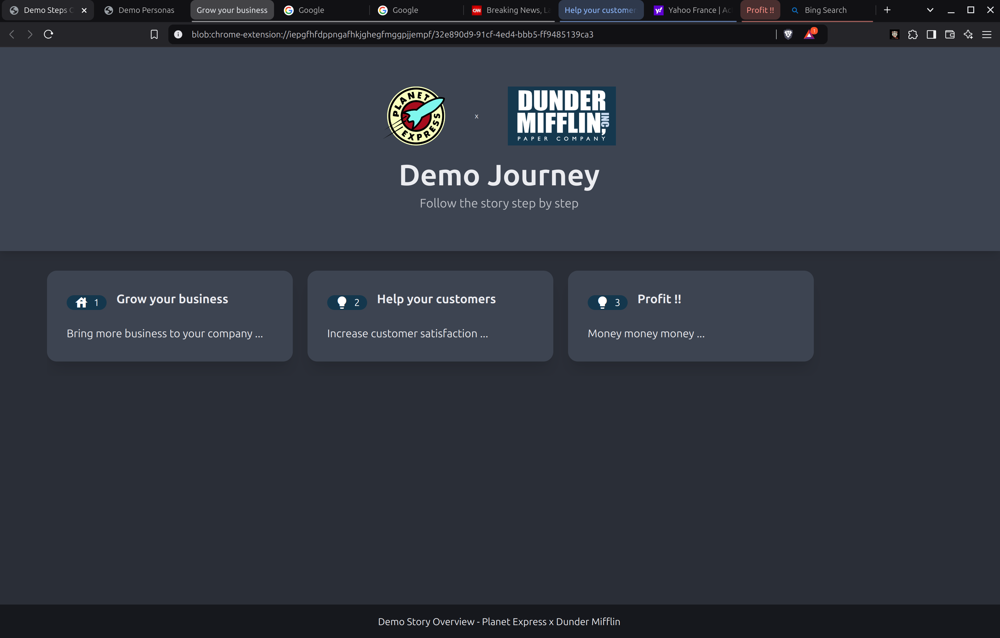
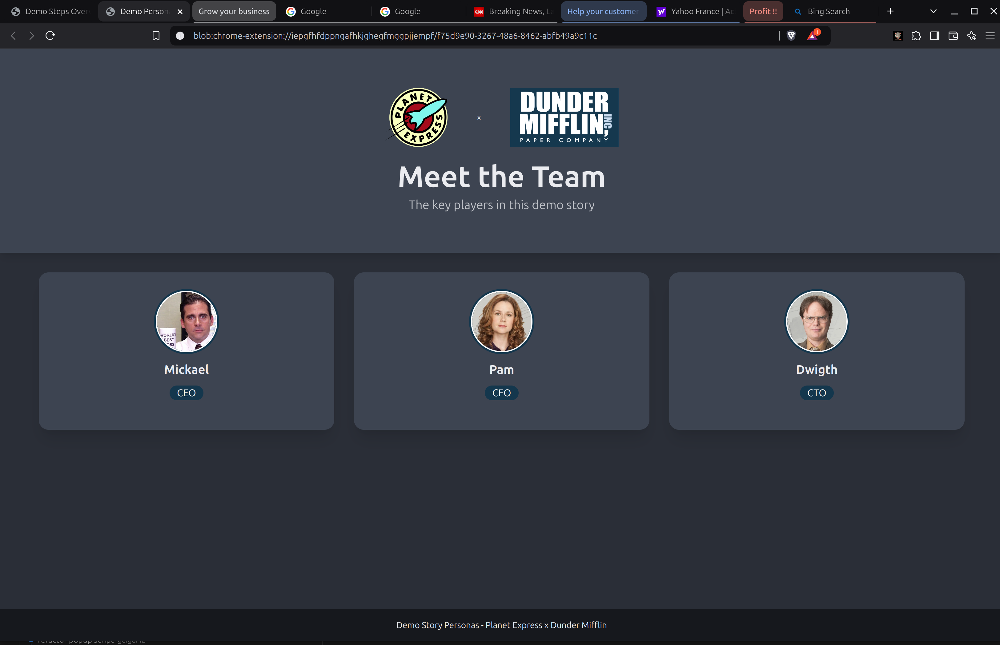
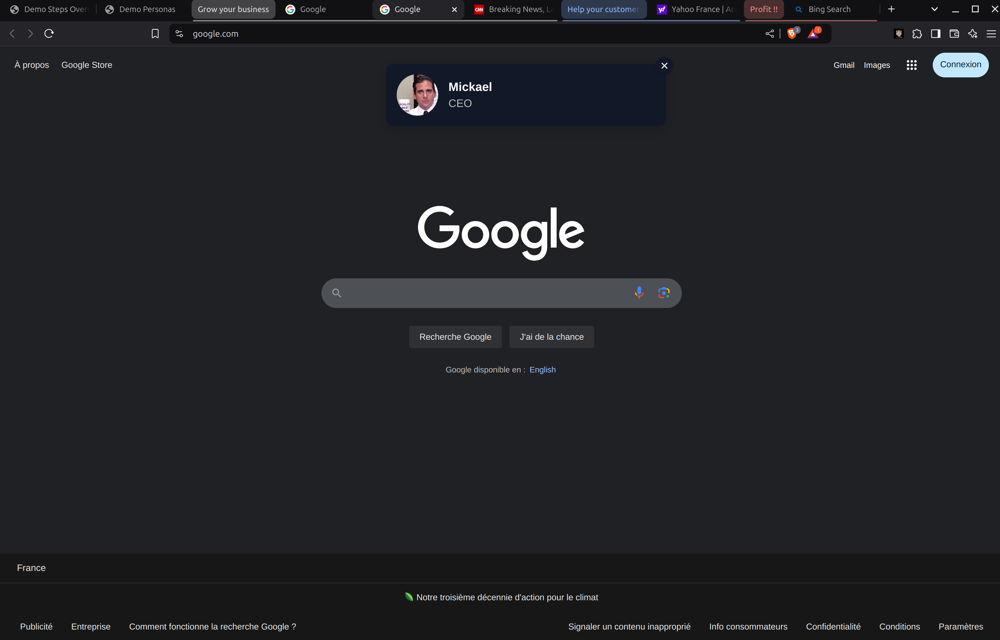
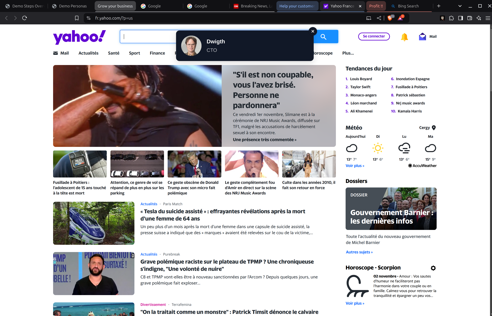

# SE Demo Story

This extension aims to make life as an SE (Sales / Solutions Engineer) easier but also to make demos more attractive to prospects.

# Features
- Easily copy/paste demo flows
- On the fly slide creation
- Choose a color theme for the generated slides
- Include Personnas in those user stories (profile cards)
- Grouped tabs

# History
The original version was built by me for a my former employer, this is a new version, build from scratch with experience and feedbacks (and cleaner code).

# To Do
UI to build the flow

# Dev Build
```bash
npm init -y
npm install webpack webpack-cli --save-dev
```

```bash
npm run build
```

# Screenshots

### Demo Overview

*Overview of all steps in the demo journey*

### Persona Cards

*Meet the team page with persona cards*

### Persona Overlay

*Draggable persona overlay on demo pages*

*Draggable persona overlay on demo pages*