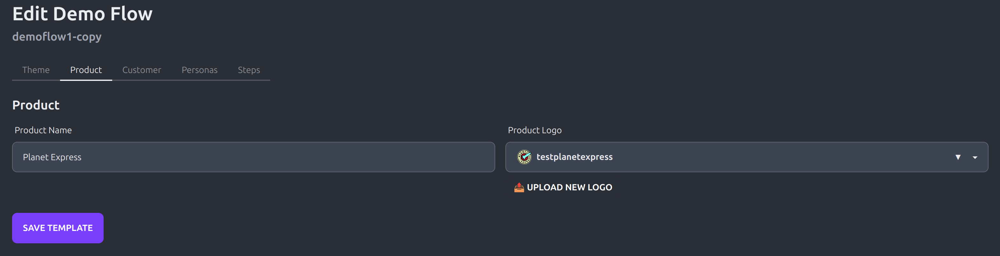
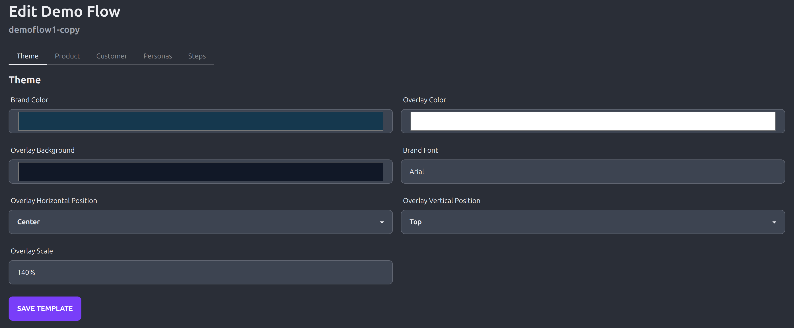
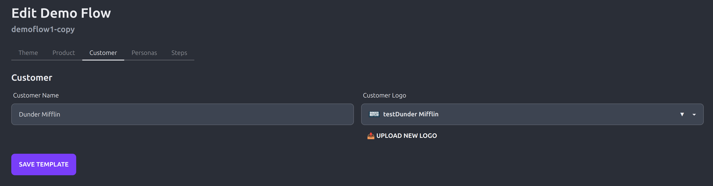
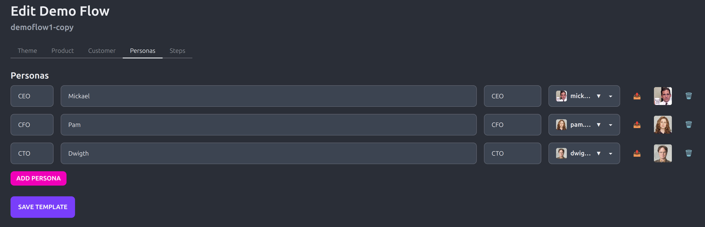
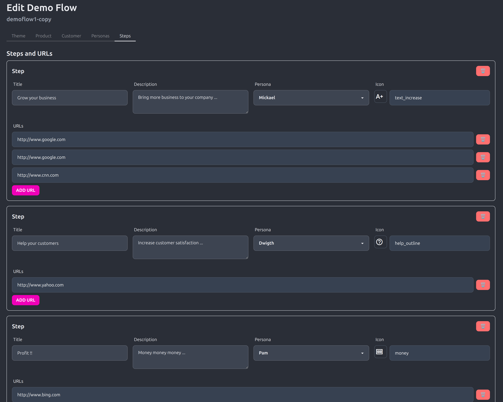
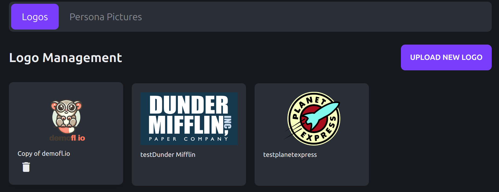
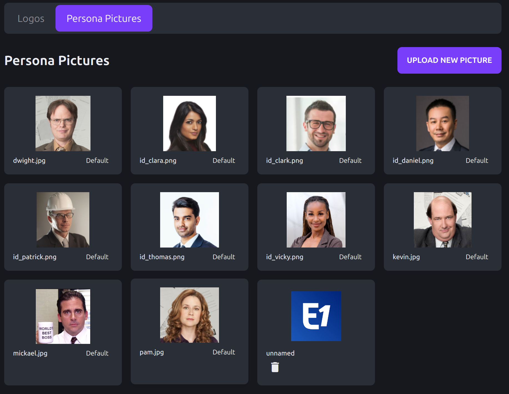

# Demofl.io


**Demofl.io** is a powerful Chrome extension designed to streamline the demo creation process for Sales and Solutions Engineers (SEs). It simplifies the way you build, manage, and present demo flows, making your presentations more engaging and effective for prospects.

## 📋 Table of Contents

- [📌 Features](#-features)
- [🎯 Value Proposition](#-value-proposition)
- [🚀 Getting Started](#-getting-started)
- [📷 Screenshots](#-screenshots)
- [💡 Tip](#-tip)
- [🛠️ To Do](#%EF%B8%8F-to-do)

## 📌 Features

- **Easy Demo Flow Management**
  - **Copy/Paste Demo Flows:** Quickly duplicate existing demo flows to save time and maintain consistency across presentations.
  - **Grouped Tabs:** Organize related tabs into groups for a cleaner and more efficient workspace.

- **Customization Options**
  - **Logos and Themes:** Personalize your demos by customizing company logos and selecting from a variety of color themes.
  - **On-the-Fly Slide Creation:** Generate slides dynamically during your demo, allowing for a more interactive and adaptable presentation.

- **Enhanced Storytelling**
  - **Persona Integration:** Incorporate detailed personas into your user stories with profile cards, adding a human touch to your demos.
  - **Color-Themed Slides:** Choose colors that align with your brand to ensure your slides are both visually appealing and consistent.

## 🎯 Value Proposition

- **Time-Saving:** Reduce the time spent on building demos by reusing and adapting your previous work effortlessly.
- **Consistency:** Maintain a professional and consistent look across all your demos with customizable themes and logos.
- **Enhanced Engagement:** Create more compelling and relatable demos by integrating personas and interactive slides, leading to better engagement with your prospects.

## 🚀 Getting Started


### Installation

You can install **Demofl.io** either directly from the Chrome Web Store or manually by following the steps below.

### 🛒 Install from the Chrome Web Store [currently being reviewed by Google]

1. **Visit the [Demofl.io Chrome Web Store page](https://chrome.google.com/webstore/detail/demoflio/your-extension-id).**
2. **Click on the "Add to Chrome" button.**
3. **Confirm the installation by clicking "Add extension" in the popup dialog.**
4. **Once installed, you'll see the Demofl.io icon in your Chrome toolbar. Click the icon to start using the extension.**


### 🛠️ Manual Installation

If you prefer to install **Demofl.io** manually, follow these steps:

1. **Download the latest release and extract the zip locally:**
    ```
    https://github.com/demofl-io/demofl.io/releases/latest/download/demoflio-extension.zip
    ```
2. **Navigate to the Project Directory:**
    ```bash
    cd demofl.io
    ```
3. **Load the Extension into Chrome:**
    - Open Chrome and navigate to `chrome://extensions/`.
    - Enable "Developer mode" by toggling the switch in the top right corner.
    - Click on the "Load unpacked" button.
    - Select the `demofl.io` folder from your project directory.


4. **Verify Installation:**
    - Once loaded, the Demofl.io icon should appear in your Chrome toolbar.
    - Click the icon to ensure the extension is working correctly.

### 🛠️ Dev Installation

1. **Install Dependencies:**
    ```bash
    npm install
    ```
2. **Build the Project:**
    ```bash
    npm run build
    ```

### 🛠️ Demo File

What a demo file looks like :

https://github.com/demofl-io/demofl.io/blob/109b3bdcabfc6cb55ec33190d6fcf0421f97d018/demos/template1.json

# 📷 Screenshots

### Demo Overview

*Overview of all steps in the demo journey*

### Persona Cards

*Meet the team page with persona cards*

### Persona Overlay

*Draggable persona overlay on demo pages*

*Draggable persona overlay on demo pages*

### Demo Editor

*Configure product details and branding*


*Customize colors and appearance settings*


*Set up customer-specific details*


*Define personas for your demo story*


*Create and organize your demo flow steps*

### Asset Management

*Manage and organize your product and customer logos*


*Handle persona pictures and profile images*

## License
This project is licensed under the MIT License - see the [LICENSE](LICENSE) file for details.

## Privacy Policy
You can read our privacy policy [here](./PRIVACY_POLICY.md).

## 💡 Tip
Create a new [browser profile](https://support.google.com/chrome/answer/2364824?hl=en&co=GENIE.Platform=Desktop) separate from your day to day usage so that the extension will only inject the script during your demo

## 🛠️ To Do

- **UI Enhancements**
  - ~~Develop a user-friendly interface for building and managing demo flows.~~
  - Expand theme customization options for more personalization.

- **Additional Functionalities**
  - Introduce more advanced features based on user feedback to further enhance the demo creation experience.

